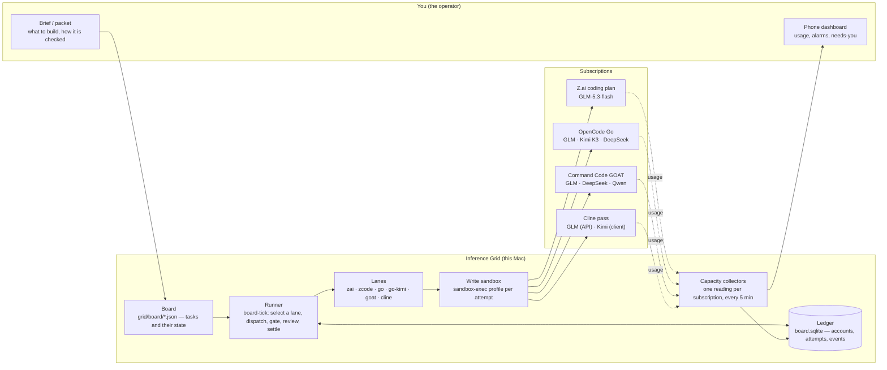
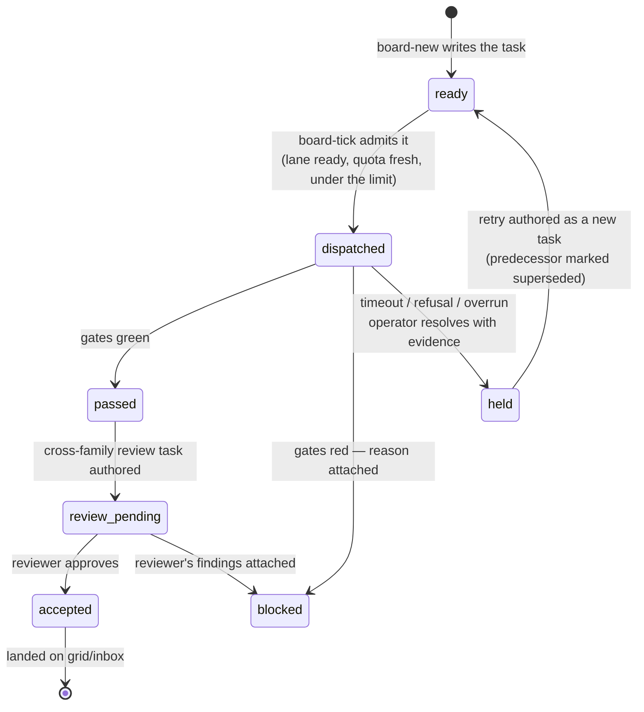
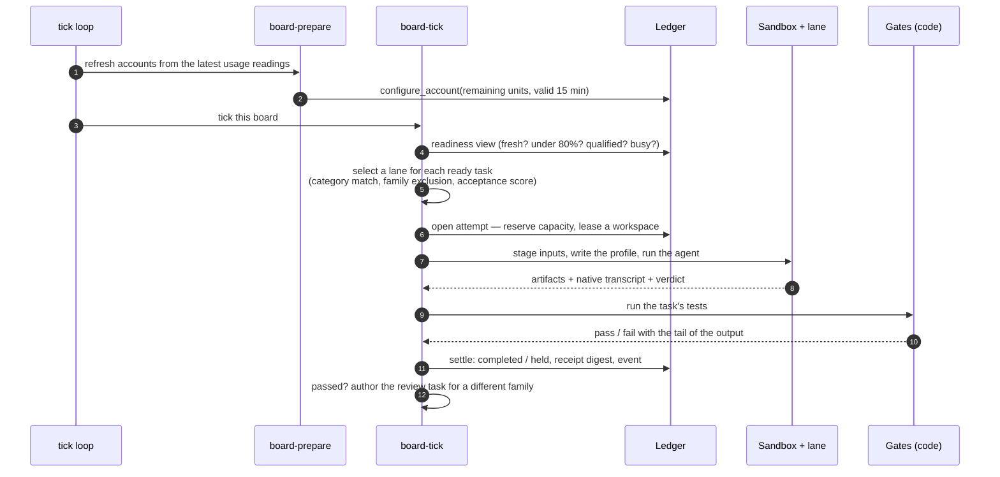
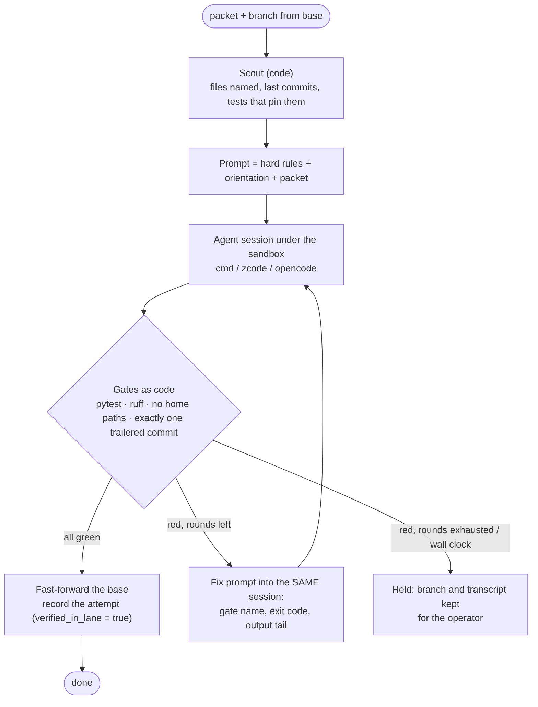
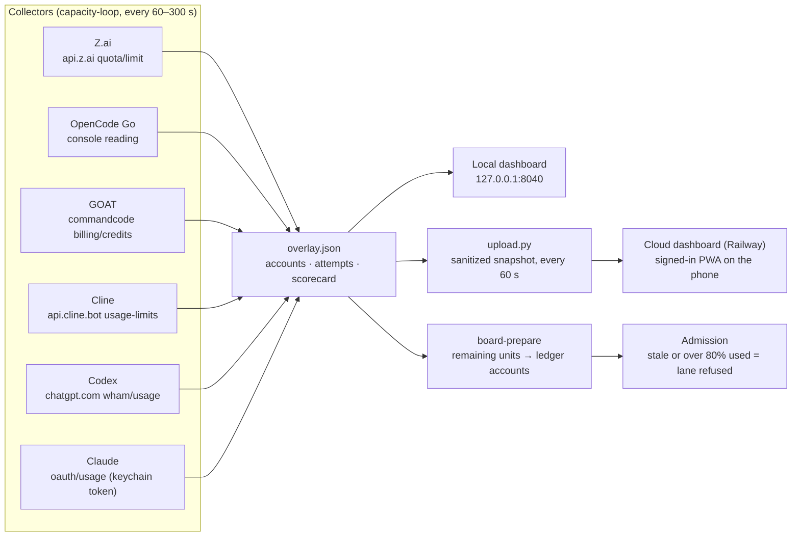

# Inference Grid — how it works and how to use it

Inference Grid turns the AI coding subscriptions you already pay for — Z.ai, OpenCode Go,
Command Code (GOAT), Cline, Codex, Claude — into one pool of capacity that does bounded work
unattended and keeps a record you can trust. You write a **packet** (what to build, how it is
checked); the grid picks a **lane** (a subscription plus a model), runs the work inside a
sandbox, runs your tests as code, gets an independent review from a *different* model family,
and lands what passes. Everything that happened is in the **ledger**.

The one-line goal: **more accepted work from the capacity you already have.**

## The pieces



| Term | Meaning |
| --- | --- |
| **Packet** | One bounded piece of work with its acceptance test, written as a brief. Small enough to finish in one session. |
| **Task** | A packet on a board, as JSON: inputs, tests, artifacts, permitted lanes, budget, state. |
| **Lane** | A way to run a model: a subscription, a model id, a *kind* (HTTP request or a CLI under the sandbox), categories it is trusted for. |
| **Attempt** | One run of a task on one lane, recorded in the ledger from admission to settlement. |
| **Gate** | A check the grid runs as code after the agent exits: pytest, ruff, a build, a commit check. Never the agent's own claim. |
| **Hold** | An attempt the grid could not settle by itself (timeout, refusal, budget overrun). Held, not retried silently; the operator resolves it with evidence. |
| **Review** | An `independent_review` task: a model from a *different family* reads the diff and returns findings. Approval accepts the work; a finding blocks it with the reason attached. |
| **Calibration** | Review packets with planted defects and an answer key, scored for recall and false positives. The number that says what an approval is worth. |
| **External** | Work done outside the grid (an interactive session, a hand-run lane), recorded after the fact so the scorecard still learns from it. |

## Life of a task



Every transition writes a ledger event with who, when and why. `board-status` reads it back
without spending quota; `board-tick --dry-run` prints what the next pass *would* do.

## One pass of the runner



## The packet loop — the agent builds, code decides

For work bigger than one request (a feature with tests), the grid does not trust the agent's
"tests pass". It re-enters the *same session* with the failures, a bounded number of times.



`scripts/run_lane.py` drives this by hand today; brief 14's D1 makes it a board task kind so
admission and the ledger apply from the start.

## Capacity — one reading per subscription, on your phone



The same reading that draws the bar on your phone decides whether a lane may run. A stale
reading refuses dispatch — which is safe, and silent. Brief 14's A1 adds the alarm.

## How to use it

### Review a branch's commits with a different model family

```sh
# One review task per commit on the branch, staged diffs, Kimi as the reviewer
inference-grid board-new --json '{"board_dir": "grid/board", "lanes": ["go-kimi"],
  "review_branch": {"repo": "/path/to/vix-rs", "base": "main", "tip": "tooling/compaction-output-dir"}}'
inference-grid board-tick --dry-run --json /tmp/tick.json   # what would run, and why not
inference-grid board-tick --json /tmp/tick.json             # run it
inference-grid board-status --json /tmp/tick.json           # verdicts, holds, findings
```

Findings arrive as `blocked_reason` on the reviewed task. "Approved, nothing accepted" means the
reviewer found nothing — read it against the calibration number, not on faith.

### Run build packets through a lane

A job file names the repo, brief, base and one entry per lane; `--job` launches every entry
as its own process, logs each to `lane-<name>.log` beside the packets, and prints a table
when they are all done. Relative paths in the file resolve against the file's directory.

```json
{"repo": ".", "brief": "docs/handoff-glm-15.md", "base": "glm/work",
 "python": ".venv/bin/python", "packets_root": "~/.grid-workspaces/packets",
 "lanes": [{"name": "goat-glm", "clone": "~/.grid-workspaces/ig-lane-a",
            "adapter": "command_code", "model": "z-ai/glm-5.3-flash", "packets": ["E1", "E2"]}]}
```

```sh
python scripts/run_lane.py --job lanes.json          # every lane, concurrently
python scripts/run_lane.py --repo . --clone ~/.grid-workspaces/ig-lane-a \
  --brief docs/handoff-glm-14.md --packets A1 B1 --base glm/work \
  --model z-ai/glm-5.3-flash --python .venv/bin/python \
  --database sqlite:///$HOME/.local/share/inference-grid/board.sqlite   # one lane, from flags
```

Each packet: its own branch, scout, agent, gates, up to three rounds, then a fast-forward of
the base and an `external` record. The flags still take exactly one lane.

### Measure a reviewer

```sh
inference-grid calibrate --json '{"board_dir": "grid/board", "project_root": ".",
  "corpus_dir": "calibration/example", "lanes": ["go-kimi"], "run_id": "kimi-20260914"}'
# ...after the board settles them:
inference-grid calibration-score --json '{"board_dir": "grid/board", "run_id": "kimi-20260914",
  "packets_root": "~/.grid-workspaces/packets", "record": true}'
```

On 2026-09-14 Kimi K3 scored recall 4/4, precision 1.00 on the seed corpus.

### Record work done elsewhere

```sh
inference-grid external --json spec.json   # task, lane, receipt, accepted, repairs
```

An interactive session, a Kanban card, a hand-run lane — the scorecard learns from it either
way, labelled `provenance: operator`.

### Resolve a hold

```sh
inference-grid resolve --json '{"aid": "<attempt id>", "outcome": "released|consumed",
  "reason": "...", "operator": "...", "evidence": {...}}'
```

`released` when native evidence shows the provider never ran; `consumed` when it did or may
have. The reason, the hold's own reason and the evidence digest go into one event.

## Where the engineer sits

Following the workflow described in the IndyDevDan analysis (`docs/research/`), the engineer is
at the two ends and nowhere in between: writing the packet, and reviewing what lands. Code
runs the gates; agents build and review; the ledger remembers. The parts of the grid that are
still hand-driven — the lane driver, the choice of lanes on a packet, noticing a stall — are
exactly the items in `docs/handoff-glm-14.md`.

## Reading the evidence

- `docs/CONTRIBUTIONS.md` — every provider attempt, accepted or not, one row each.
- `inference-grid evaluation` — the scorecard as a document.
- `inference-grid digest` — per board and per lane, what is waiting and what is stuck.
- `~/.grid-workspaces/packets/<task>/<stamp>/` — the attempt's inputs, transcript, gates and
  verdict, exactly as the lane saw them.
